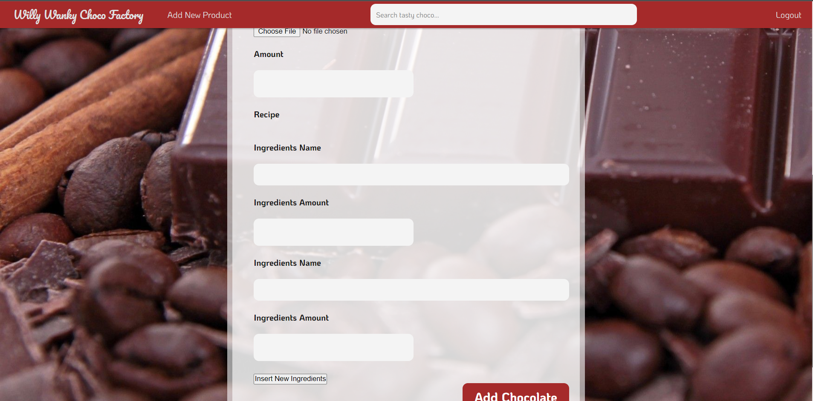

# Tugas 1 IF3110 Pengembangan Aplikasi Berbasis Web

## Deskripsi aplikasi web.

Willy Wangky Choco Factory adalah sebuah platform web yang mendistribusikan produk coklat yang dihasilkan oleh perusahaan Willy Wangky.

Saat Pengguna mengakses platform, pengguna akan diarahkan ke halaman login jika pengguna belum login, atau halaman dashoard jika pengguna sudah login.

Pada halaman login, pengguna dapat melakukan login menggunakan email dan password yang sudah didaftarkan sebelumnya. Jika pengguna belum memiliki akun, pengguna dapat
mengakses halaman register.

Pada halaman register, pengguna dapat membuat akun baru dengan memasukkan username, email, dan password. 

Pada halaman dashbooard, pengguna akan melihat sepuluh produk dengan penjualan terbanyak. Pengguna dapa mengklik produk tersebut untuk menuju ke halaman detail
yang mendaftarkan nama produk, jumlah terjual, jumlah stok, harga, dan deskripsi, serta pilihan untuk membeli produk. Dengan memilih pilihan beli, pengguna dapat memasukkan
jumlah produk tersebut yang ingin dibeli.

Pengguna dapat melihat history transaksi yang telah dilakukan pengguna dengan mengakses menu History pada header.

## Perubahan Basis Data
Tidak ada

# Screenshot Perubahan Aplikasi

 

## Pembagian Tugas

### WS-Factory
1. Saldo : ...
2. Recipe : ...
3. Ingredients : ..., 13518141 (addNewIngredients)
4. Request : 13518141
5. Transaction : ...
6. SOAPPublisher
7. Chocolate :

### WS-Supplier
1.  
2.
3.

### WW-Factory
1.
2.
3.

### WW Web Aplication
1.
2.
3.

